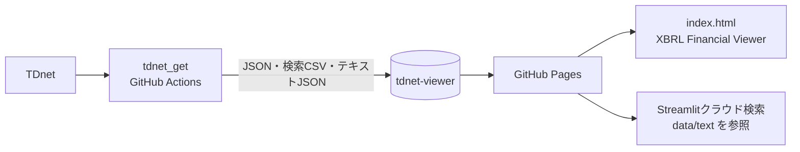

# tdnet-viewer

TDnetのXBRL財務分析結果を、ブラウザ上で一覧・詳細閲覧するための静的サイトです。

このリポジトリ自体は取得や解析を行いません。姉妹リポジトリ[`tdnet_get`](https://github.com/onokazu777/tdnet_get)のGitHub Actionsが生成したJSON・CSVを受け取り、GitHub Pagesで公開します。

## 公開先・関連リポジトリ

- XBRL Financial Viewer: https://onokazu777.github.io/tdnet-viewer/
- 公開データリポジトリ（本リポジトリ）: https://github.com/onokazu777/tdnet-viewer
- データ生成・更新処理: https://github.com/onokazu777/tdnet_get/actions
- 生成側リポジトリ: https://github.com/onokazu777/tdnet_get

## 処理の概要



平日の17:05、20:05、23:55（JST）に`tdnet_get`のActionsが起動し、差分を本リポジトリへpushします。push後、GitHub Pagesが静的ファイルを配信します。

## 主な構成

- `index.html`  
  XBRL Financial Viewer本体。`data/index.json`を読み込み、ソート・検索・詳細モーダルをブラウザ上で処理します。
- `data/index.json` / `data/detail/*.json`  
  一覧と会社別詳細。Viewer画面が直接利用します。
- `data/text/`  
  PDF本文の日別JSON。`tdnet_get`のStreamlitキーワード検索（クラウドモード）が参照します。`index.html`は使いません。
- `data/search/`  
  キーワード検索・配布用CSVの保管場所。`index.html`は使いません。
- `data/stock_cache.json`  
  過去に置かれた株価キャッシュ。現行のViewer画面は参照せず、一覧のPBR等は`index.json`各行に含まれます。

## 詳細ドキュメント

- [システム構成](docs/system-architecture.md)
- [データフローとファイル一覧](docs/data-flow.md)
- [プログラム一覧](docs/programs.md)
- [運用・障害対応](docs/operations.md)

## ローカル確認

静的ファイルだけなので、ローカルHTTPサーバーで開けます。

```powershell
cd C:\path\to\tdnet-viewer
python -m http.server 8080
```

ブラウザで http://localhost:8080/ を開きます。`file://`直接開きでは`fetch`が失敗することがあるため、HTTP経由を推奨します。

## 機密情報

本リポジトリにSecretsは不要です。`tdnet_get`側のRepository secret `VIEWER_PAT`で、本リポジトリへのclone・pushを行います。
