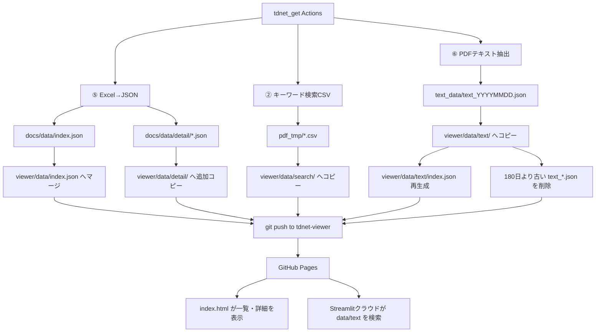

# データフローとファイル一覧

## データの流れ



## リポジトリ内の配置

```text
tdnet-viewer/
├─ index.html
├─ README.md
├─ docs/                         本ドキュメント群
└─ data/
   ├─ index.json                 XBRL一覧（Viewer入力）
   ├─ stock_cache.json           現行フロー未更新・Viewer未使用
   ├─ detail/
   │  └─ YYYYMMDD_<コード>.json  会社別詳細（Viewer入力）
   ├─ search/
   │  ├─ Analysis_Hits_free_word_<対象>.csv
   │  └─ PDF_Search_Result_Distribution_free_word_<対象>_sh.csv
   └─ text/
      ├─ index.json              利用可能日付一覧
      └─ text_YYYYMMDD.json      ページ別PDF本文
```

## ファイル別の役割

### `data/index.json`

一覧テーブルのマスタです。配列形式で、各要素は次のフィールドを持ちます。

| フィールド | 内容 |
|---|---|
| `date` | 表示用日付（例: `2026/07/17`） |
| `date_raw` | フィルタ・ソート用（例: `20260717`） |
| `code` | 証券コード |
| `company` | 会社名 |
| `title` | 開示表題 |
| `rev_chg` | 増収率% |
| `op_cur` | 営業利益率 当期% |
| `op_prev` | 営業利益率 前期% |
| `op_diff` | 営業利益率 差分pt |
| `pbr` | PBR（倍） |
| `forward_pe` | 予想PER（倍） |
| `div_yield` | 配当利回り% |
| `detail` | 詳細ファイル名（例: `20260717_7203.json`） |
| `pdf_url` | TDnet PDF URL（無い場合あり） |

`tdnet_get`のマージ処理では、`detail`ファイル名をキーに重複判定します。新規なら追加、既存なら`pbr`・`forward_pe`・`div_yield`・`pdf_url`を更新します。

### `data/detail/YYYYMMDD_<コード>.json`

会社名クリック時に読み込む詳細です。現状のトップレベルは`sheets`オブジェクトのみです。

典型的なシート名:

- `分析サマリー`
- `財務データ一覧`
- `XBRLデータ（Raw）`

各シートの値は行配列（Excel相当の2次元配列）です。`分析サマリー`は専用レンダラ、それ以外は表形式レンダラで表示します。

詳細ファイルは存在するなら上書きせず、未配置のものだけコピーします。

### `data/text/text_YYYYMMDD.json`

PDF本文検索用です。`index.html`は参照しません。

| フィールド | 内容 |
|---|---|
| `date` | `YYYYMMDD` |
| `extracted_at` | 抽出時刻 |
| `file_count` | PDF件数 |
| `files` | PDFごとの配列 |

`files`の各要素:

| フィールド | 内容 |
|---|---|
| `pdf` | PDFファイル名 |
| `code` | 証券コード |
| `company` | 会社名 |
| `category` | 分類 |
| `url` | TDnet URL |
| `pages` | ページ本文の文字列配列 |

### `data/text/index.json`

Streamlitクラウド検索が日付一覧を取得するための索引です。

```json
{
  "dates": ["20260120", "20260121", "..."],
  "updated": "2026-07-19T22:53:52"
}
```

`tdnet_get`のActionsが、`data/text`内の`text_*.json`から毎回作り直します。あわせて、日付が今日から180日より古い`text_*.json`を削除します。

クラウド検索の参照先:

```text
https://onokazu777.github.io/tdnet-viewer/data/text
```

### `data/search/*.csv`

`tdnet_get`の②で作った次のCSVをコピーしたものです。

- `Analysis_Hits_free_word_<対象>.csv`
- `PDF_Search_Result_Distribution_free_word_<対象>_sh.csv`

`index.html`は使いません。公開リポジトリ上の保管・共有用です。

### `data/stock_cache.json`

証券コードをキーにした株価指標キャッシュです。現行の`index.html`は読みません。また、現行の`daily_update.yml`マージ手順もこのファイルを本リポジトリへ更新していません。一覧に出るPBR等は`index.json`各行の値です。

## Viewerが表示時に読むファイル

| 操作 | 読み込むファイル |
|---|---|
| 初回表示 | `data/index.json` |
| 会社名クリック | `data/detail/<detail>` |
| 表題クリック | 外部の`pdf_url`（TDnet） |

## 注意事項

- 本リポジトリのコミットの大半は`tdnet_get` Actionsによる`Auto update: ...`です。
- GitHub Pages反映にはpush後数分かかることがあります。
- TDnetのPDF URLは公開から約30日で無効になる場合があります。長期保管PDFは`tdnet_get`がGoogle Driveへ保存します。
- `data/text`は保持期間180日のため、古い日付のクラウド全文検索はできなくなります。
