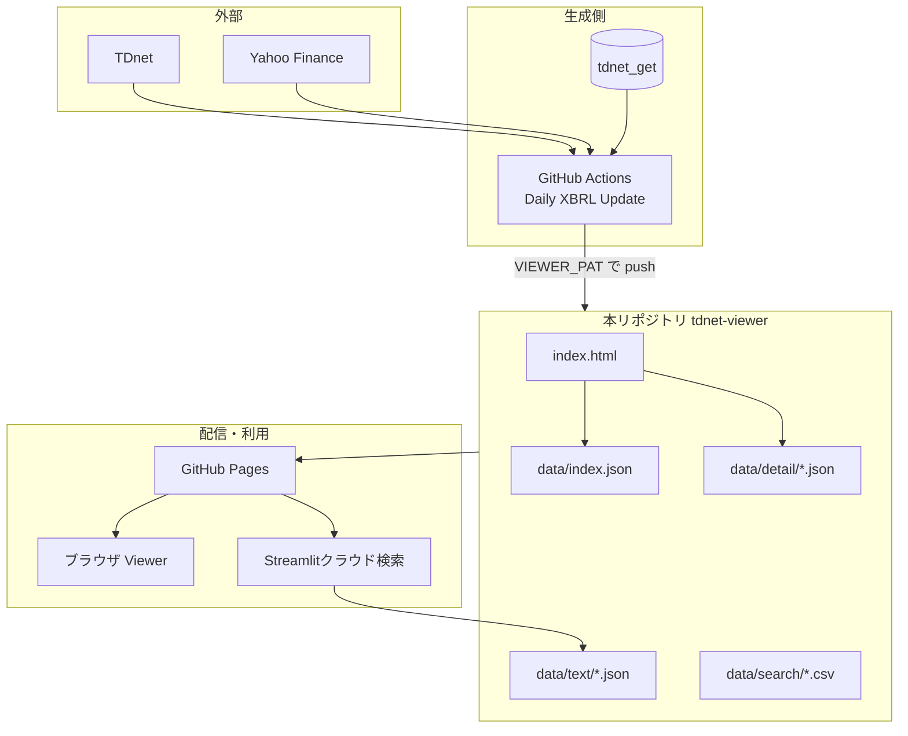

# システム構成

## 目的

`tdnet_get`が生成したXBRL財務分析データを、GitHub Pages上の静的Viewerとして公開します。あわせて、PDF全文検索用のテキストJSONと検索結果CSVを同じ公開リポジトリに置き、他システムから参照できるようにします。

## 全体構成



## コンポーネント

### 1. `tdnet-viewer`リポジトリ（本リポジトリ）

静的ファイルのみを保持します。GitHub Actionsのworkflow、Pythonコード、ビルド手順はありません。

| パス | 役割 |
|---|---|
| `index.html` | XBRL Financial Viewer（SPA） |
| `data/index.json` | 一覧マスタ |
| `data/detail/*.json` | 会社・日付ごとの詳細 |
| `data/text/` | PDF本文JSONと日付一覧 |
| `data/search/` | キーワード検索・配布CSV |
| `data/stock_cache.json` | 現行Viewer未使用のキャッシュファイル |

### 2. GitHub Pages

- URL: https://onokazu777.github.io/tdnet-viewer/
- 配信元: 本リポジトリの`main`ブランチ上の静的ファイル
- 利用者:
  - ブラウザで`index.html`を開く人
  - `tdnet_get`の`keyword_search_app.py`（クラウドモード）が`data/text`を取得する処理

### 3. `tdnet_get`（データ生成元）

日次処理の実行主体です。本リポジトリは生成結果の受け皿です。

- リポジトリ: `onokazu777/tdnet_get`
- ワークフロー: `.github/workflows/daily_update.yml`
- 定期実行: 平日15:35、17:05、20:05、23:55（JST）
- 認証: Repository secret `VIEWER_PAT`

Actionsは本リポジトリをcloneし、JSON・CSVをマージまたは上書きしたうえで、変更があれば`Auto update: <対象>`というコミットメッセージでpushします。

### 4. Viewer画面（`index.html`）

HTML/CSS/JavaScriptだけのシングルページです。サーバー側ロジックはありません。

起動時の動き:

1. `data/index.json`を`fetch`
2. 日付プルダウンを生成
3. テーブルを描画

操作時の動き:

- ソート（セレクトまたはヘッダークリック）
- 会社名・コード・表題のテキスト検索
- 日付フィルタ
- 会社名クリックで`data/detail/<detail>`を`fetch`し、モーダル表示
- 表題が`pdf_url`を持つ場合、TDnetのPDFへリンク

詳細JSONはブラウザ内の`detailCache`に保持し、同じファイルの再取得を避けます。

## 実行経路

### データ更新（本番）

```text
tdnet_get schedule / 手動 Run workflow
  → PDF・XBRL取得・解析
  → 公開用JSON・テキストJSON・検索CSV作成
  → tdnet-viewer を clone
  → 既存 index.json とマージ、detail / search / text を配置
  → push（変更がある場合）
  → GitHub Pages 反映
```

### 画面表示

```text
ユーザーが GitHub Pages URL を開く
  → index.html 配信
  → ブラウザが data/index.json を取得
  → 必要時に data/detail/*.json を取得
```

本リポジトリ単体ではデータ更新できません。更新は必ず`tdnet_get`側で行います。

## 設定値

本リポジトリ側の設定はありません。

| 場所 | 名前 | 用途 |
|---|---|---|
| `tdnet_get` Secrets | `VIEWER_PAT` | 本リポジトリのclone・push |

## 外部依存

- `tdnet_get`のGitHub Actions: データ供給
- GitHub Pages: 静的配信
- TDnetのPDF URL: 表題リンク先（公開から約30日で無効になる場合あり）
- Streamlit（任意）: `data/text`を検索するクラウドモード

## 本リポジトリに含まれないもの

- TDnetへのアクセス処理
- XBRL解析・Excel生成
- Google Drive保存
- GitHub Actionsのスケジュール定義
- Streamlitアプリ本体

これらはすべて`tdnet_get`側にあります。
